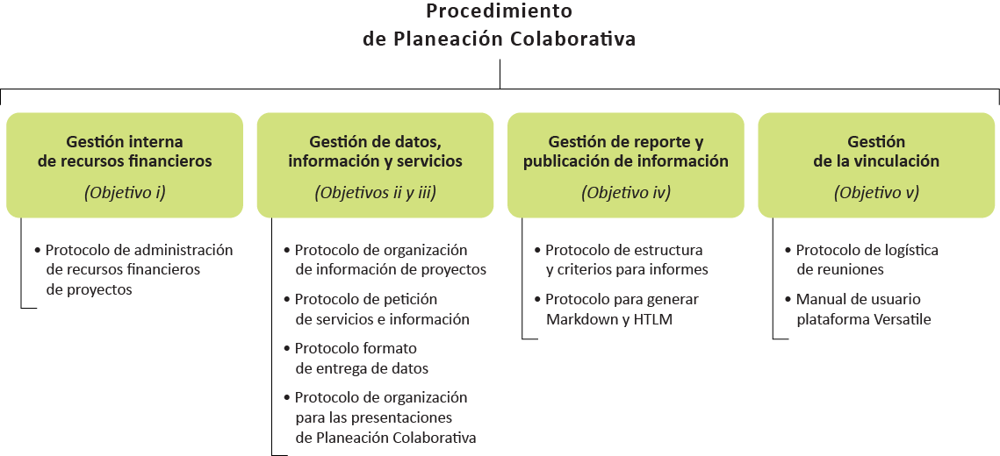

# Procedimiento del Área de Planeación Colaborativa

* * *

## Objetivo y alcance

**Objetivo general**

Realizar evaluaciones de sostenibilidad con base en estándares sistemáticos, rigurosos y transparentes de recepción, gestión, síntesis y publicación de información realizadas en el área de planeación colaborativa.  

**Objetivos particulares**
*	Administrar eficientemente los recursos financieros de los proyectos.
*	Administrar la información recibida y generada durante los proyectos.
* Coordinar los recursos humanos para asegurar la entrega de productos en tiempo y forma; así como crear coherencia en los procesos de trabajo y garantizar la continuidad de las actividades programadas.
* Estandarizar los procesos para la generación de reportes y publicación de información en línea e impresa.
*	Estandarizar y mejorar las interacciones con los actores sociales e instituciones.

**Alcance:**

Hacer evaluaciones de sostenibilidad que respondan preguntas de gestión y toma de decisiones de nuestros clientes, a través de combinar los últimos adelantos en el desarrollo de políticas públicas, planeación del uso del suelo, modelación geoespacial, biocomplejidad, teoría de decisión, geovisualización, gobernanza y aprendizaje social. Así, se busca construir instrumentos apropiados y visualmente eficaces para la traducción y comunicación de conocimiento científico a ejecutivos y funcionarios de los sectores público, privado y social, que permitan ligar la ciencia en la toma de decisiones durante el proceso de planeación y, con ello, facilitar el tránsito hacia la sostenibilidad.

## Términos, definiciones y abreviaturas:

**Términos y definiciones**

No aplica

**Abreviaturas**
* APC: Área de Planeación Colaborativa
* LANCIS: Laboratorio Nacional de Ciencias de la Sostenibilidad
* PPC: Procedimiento de Planeación Colaborativa
* RD: Representante de la Dirección
* SIGC: Sistema Integral de Gestión de la Calidad
* RSIGC: Responsable del Sistema Integral de Gestión de la Calidad

## Responsabilidad y autoridad:

* La aprobación del PPC es responsabilidad del Director, previa revisión por parte del RD.
* Es responsabilidad del RSIGC que el PPC funcione a fin de mantener el SIGC en  LANCIS.
* El RSIGC entrega al RD el documento de PPC para una revisión previa a la entrega a la Dirección para su aprobación. El RD tendrá 15 días para revisar el PCD. Una vez revisado, será entregado al Director quien tendrá una semana para aprobarlo o devolverlo para modificaciones.
De no haber inconveniente, se recomienda que el PPC sea revisado cada 2 años, o antes si es necesario.

**Actualización de documentos**

El RSIGC y el responsable del APC registran los cambios y actualizaciones identificadas como necesarias, ya sea por ellos mismos o sugeridas por los usuarios.
El RSIGC actualiza y realiza las modificaciones pertinentes en el procedimiento, de acuerdo con las necesidades del APC y los de Gestión, así como, con los hallazgos de Auditoría. La versión modificada de los documentos debe ser revisada y entra en vigencia cuando esté aprobada.

## Descripción de actividades

El PPC contempla la ejecución de cuatro componentes de gestión asociados a los objetivos particulares de este procedimiento y que son: (a) Gestión de recursos financieros, (b) Gestión de datos, información y servicios, (c) Gestión de reporte y publicación de información y (d) Gestión de la vinculación. La Figura 1. muestra la asociación de los objetivos particulares con los componentes, y los protocolos específicos para el cumplimiento de los objetivos.

## Referencias

No aplica
