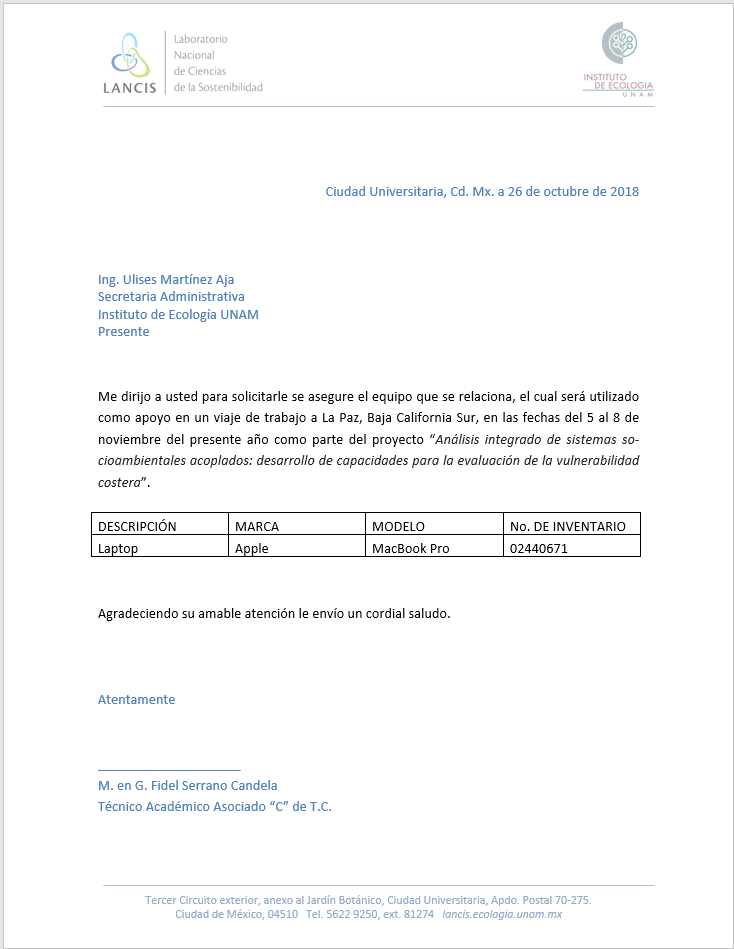

# Protocolo de logística para reuniones y/o talleres externos

* * *

# Objetivo y alcance

**Objetivo:** Definir las actividades, materiales y responsabilidades en la planeación de una reunión y/o taller externo.

**Alcance:** Aplica para los colaboradores que participan en las reuniones y/o talleres organizadas por el equipo del Área de Planeación Colaborativa (APC).

* * *

# Protocolo

Los colaboradores deben cumplir con las actividades descritas en este protocolo para la organización de reuniones y/o talleres externos.

* * *

# Materiales, equipos y reactivos

**Materiales**

* Listas de asistencia
*	Orden del día
*	Documentos a repartir
* Extensiones
* Multicontactos
* Hojas blancas
* Hojas rotafolio
* Post it
* Etiquetas
* Block para notas
* Lápices
* Plumón pizarrón blanco
* Plumón permanente
* Maskin tape
* Enchufe adaptador
* Adaptadores VGA


**Equipo**

*	Equipo de cómputo
*	Equipo de proyección
*	Equipo de grabación de sonido
*	Equipo fotográfico
* Formato de salida de equipo


Nota: La cantidad del material y del equipo dependerá del número de participantes de la reunión y/o taller.

* * *
# Actividades y responsables

## Planeación

La planeación iniciará con una reunión del equipo de trabajo que irá a la sesión con la meta de definir
el objetivo del evento y la asignación de responsables para preparar la logística del mismo.

Esta reunión se realizará con una anticipación de una a dos semanas antes del día de la reunión y/o taller.


**Planificación de la reunión y/o taller**

*	Definir los objetivos
*	Identificar a los participantes
*	Identificar los insumos requeridos
*	Definir roles y responsabilidades
*	Definir al coordinador de la reunión y/o taller

**Logística de la reunión y/o taller**

Dependiendo del tipo de reunión y/o taller se realizarán alguna o todas de las actividades que se describen a continuación:

*	Desarrollar el orden del día
*	Imprimir lista de asistencia
*	Determinar los materiales para la reunión y/o taller (ver lista de materiales)
* Hacer trámites de salida (formatos de salida y de seguros de equipo, seguros de viajero)

Formato registro de asistentes

```
ORGANIZACION_APC/apc_iso/formatos_lista_asistencia/FRA_SGC VER 1.docx
```

Formato de registro de reunión (minuta)

```
ORGANIZACION_APC/apc_iso/formatos_lista_asistencia/FRR_SGC VER 1.docx
```

Vale de entrada y salida de equipo y mobiliario

```
http://web.ecologia.unam.mx/index.php/formatos-secretaria-administrativa
```

El formato del vale de salida es indispensable que sea firmado por el investigador responsable, del responsable de servicios generales y de vigilancia


**Procedimiento de seguros de salida de equipo**

El trámite del seguro del equipo se tramita con 7 días hábiles previos a la salida en la Secretaría Administrativa y se hace mediante una carta dirigida al Secretario Administrativo en turno, ver el ejemplo de la carta.



**Procedimiento de seguros de viajero**

*Académicos y técnicos*, se tiene que tramitar el "Seguro de vida nacional y extranjero Metlife", el cual se encuentra en la sección de Formatos Secretaría Administrativa de la página del Instituto de Ecología.

*Estudiantes*, se debe tramitar la póliza para prácticas de campo.

Los formatos se encuentran en la siguiente liga y deberán tramitarse 5 días hábiles previos a la salida:

```
http://web.ecologia.unam.mx/index.php/formatos-secretaria-administrativa
```

Para activar la póliza es necesario entregar en la Secretaría Administrativa el formato de prácticas de campo llenado debidamente y firmado por el investigador responsable, y una copia de la identificación oficial (INE o pasaporte vigente) por cada alumno que va a participar en las reuniones y/o talleres fóraneos.

*Proveedores*, en caso de no contar con un seguro de gastos médicos deberán contratar un seguro de gastos médicos de viajero por el tiempo que dure el viaje.


## Elaboración de la presentación

En caso de requerir una presentación se deberá revisar el [Protocolo de logística](protocolo_logistica.html) y/o [Protocolo de organización de activos de información](protocolo_org_activ_info/protocolo_org_activ_info.html)

## Desarrollo de la reunión y/o taller

El día de la reunión y/o taller se llevarán acabo las siguientes actividades:

*	Llegar treinta minutos con anticipación a la sesión para verificar la infraestructura requerida
y material para la sesión.
*	Colocar las listas de asistencia.
*	Colocar el equipo de grabación de sonido en un lugar estratégico para que se pueda grabar a todos los participantes.
* Preparar el equipo de cómputo y proyección.
* De requerirse, preparar la mesa del coffee brake

La persona asignada para las actividades de logística deberá:

* Verificar que la grabadora está encendida y apagarla cuando termina la sesión.
* Verificar que todos los participantes se registren en la lista asistencia.
* Verificar que el equipo y material esté completo

## Seguimiento

Al término de la reunión se realizarán las siguientes actividades:

Equipo de trabajo

*	Recolectar las listas de asistencia, equipo de cómputo y material
*	Revisar el lugar de la reunión y dejar todo en orden

Coordinador responsable de la reunión y/o taller

Una vez que estén de regreso en APC deberá realizar las siguientes actividades:

* Escanear y guardar la información física recopilada
*	Mandar a los participantes la minuta de la reunión y/o taller

# Referencias

No aplica
