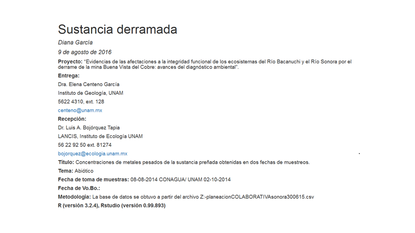
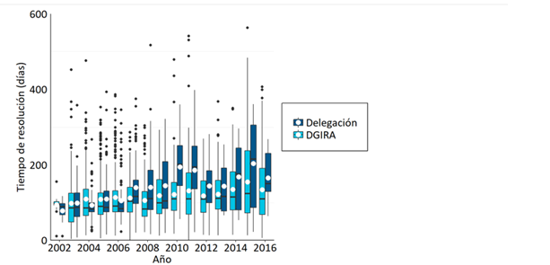
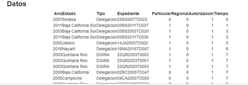

# Protocolo de generación de gráficas y mapas con salida en HTML

* * *

# Objetivo y alcance

**Objetivo:** Estandarizar la elaboración de mapas y gráficas elaborados por el Área de Planeación Colaborativa (APC) en la realización de los proyectos, así como la información relacionada con los servicios ejecutados.

**Alcance:** Aplica para los proyectos desarrollados por APC.
* * *

# Protocolo

El desarrollo y gestión de la información representada en los mapas y gráficas es la base para los estudios realizados por el APC, por lo tanto, se vuelve fundamental y prioritario seguir un orden en su creación y resguardo.

Para dar salida, respaldo y acceso a las gráficas y mapas, el script debe ser hecho en Markdown (Md) como una herramienta que permite la conversión de texto plano a un HTML de forma muy sencilla, ver:

```
http://rmarkdown.rstudio.com/lesson-1.html
```
**Requisitos para recibir base de datos**

*	Llenar el formato de registro de entrega de datos ver lancis_fed_pcr.xlsx, en:
```
ORGANIZACION_APC/apc_iso/protocolos
```
* Las bases de datos deben estar contenidas en archivos de Excel o libre office.

* Los archivos deben estar en formato tipo .xls, .xlsx y .csv

* Los Excel o csv deben venir nombrados clara y correctamente, con el siguiente formato:
bd_proyecto_nombre_fecha evitando poner cualquiera de los siguientes caracteres:
< > ´ : " \ | / { } * ? ' @ + ~ ñ # % &

Donde:

bd= base de datos

proyecto= nombre del proyecto de donde proceden los datos

nombre= del archivo, ya sea tema, título o algo que indique el contenido

fecha= dato del ddmesaño (ver las abreviaturas de los meses, tabla 1) de cuando se envía esa versión de los datos.

**Tabla 1.** Mes y abreviatura.

| Mes  |	Abreviatura |
| ---  |  :------:    |
| enero  |	ene       |
| marzo  |	mar       |
| abril  |	abr       |
| mayo   |	may       |
| junio  |	jun       |
| julio  |	jul       |
| agosto |	ago       |
| septiembre | sep    |
| octubre |	oct       |
| noviembre	| nov     |
| diciembre |	dic     |

Ejemplo:
bd_megadapt_escasez_10ago2017

* La hoja de datos (bd) debe tener columnas con nombres claros y específicos, además de contener las unidades correspondientes (si es el caso, km, mm, cm, etc.). Cualquier modificación hecha a la bd original debe estar documentada agregando un bloc de notas adjunto (README)


* * *
# Materiales, equipos y reactivos
No aplica.

* * *

# Actividades y responsables

Para hacer una gráfica se debe contar con las bases de datos en csv.

**Nombre de las gráficas y Md:**

Estos archivos deben ser nombrados de la siguiente forma:

gr_nombre_proyecto_fecha

Donde:

gr= gráfica

nombre= tema o título que indique el contenido de la gráfica

proyecto= nombre del proyecto de donde proceden los datos

fecha= día, mes y año de cuando se envía esa versión de los datos

En caso de tratarse de un pre procesamiento de datos, cuyo fin no es el de obtener una gráfica o un mapa, debe de indicarse en el nombre del Md de la siguiente forma:

pre_analisis_nombre del tema o archivo que se trabaja_fecha

**Información contenida en los Md**

Los Md deben tener la siguiente información al inicio y fuera de los chunks, con el fin de tener una cadena de custodia.

El siguiente es un ejemplo de sintaxis con formato básico de un Md:


#####**Proyecto:** “Evidencias de las afectaciones a la integridad funcional de los ecosistemas del Río Bacanuchi y el Río Sonora por el derrame de la mina Buena Vista del Cobre: avances del diagnóstico ambiental”.
#####**Entrega:**
#####Dra. Elena Centeno García
#####Instituto de Geología, UNAM
#####5622 4310, ext. 128
#####centeno@unam.mx
#####**Recepción:**
#####Dr. Luis A. Bojórquez Tapia
#####LANCIS, Instituto de Ecología UNAM
#####56 22 92 50 ext. 81274
#####bojorquez@ecologia.unam.mx
#####**Título:** Concentraciones de metales pesados de la sustancia preñada obtenidas en dos fechas de muestreos.
#####**Tema:** Abiótico
#####**Fecha de toma de muestras:** 08-08-2014 CONAGUA/ UNAM 02-10-2014
#####**Fecha de Vo.Bo.:**
#####**Metodología:** La base de datos se obtuvo a partir del archivo Z:\respaldo\servidor-planeacionCOLABORATIVA\Rio sonora300615.csv
#####**R (versión) Rstudio (versión )**. Es importante que se especifique la versión de R y Rstudio en el que fueron corridos los datos.

Nota:
Para dar formato al texto,  en Markdown se utilizan signos de puntuación y caracteres básicos; se recomienda consultar los siguientes enlaces para conocer cómo operan:
```
http://rmarkdown.rstudio.com/authoring_basics.html
```
```
https://www.rstudio.com/wp-content/uploads/2015/03/rmarkdown-reference.pdf
 ```
Los “hashtags” (#) y asteriscos (*) definen el tamaño de letra y que éstas se vean en negrillas, respectivamente.

Ejemplo:



El orden de los comandos recomendado para realizar un Md es el siguiente:

* Libraries (se contará con un repositorio para facilitar el uso de las mismas)
*	Data.frame
*	Objets <-


*	Geoms
* Scales
*	Labs
*	Theme


En caso de que la gráfica haya sido editada en algún otro programa (Photoshop, ilustrator etc.) para efectos de presentación, esto deberá ser mencionado como nota en el md y se agregará la versión final de la gráfica con el siguiente comando fuera del chunk:

![Caption for the picture.] (Z:\Procesamiento\Graficas\faseaguda\superficial_muestreo\G_SOL_M_Al31.png)

En caso de que la base de datos se haya agregado desde un csv, la tabla de datos se agrega al final del markdown (dentro de un chunk) con el siguiente comando:

```{r,echo=FALSE}

knitr::kable(laTablaAl)

Dentro del paréntesis va a el nombre de la base de datos correspondiente.

En caso de que la base de datos sea muy grande, se podrá agregar sólo parte de ella.

Ejemplo:






# Referencias

http://rmarkdown.rstudio.com/authoring_basics.html

http://www.analiticaweb.es/agilidad-facilidad-markdown/

http://rmarkdown.rstudio.com/lesson-1.html
